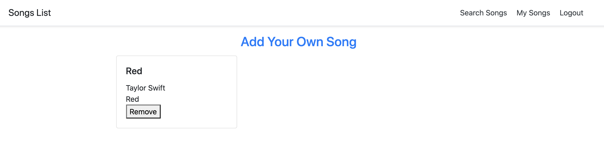

# Mongo_FullStack_CRUD_Application
This is a web application which enables user to login with Facebook account and manage their list favorite songs.
## App View:

## Technologies Used:
- MongoDB and MongoDB Altas
- Express
- Node
- Passport 
- Heroku

## Getting Started:
- Open at Heroku: https://peaceful-beach-70552.herokuapp.com/

- Trello board: https://trello.com/b/uxFpUvSu/ga-schedule

## Next Steps:
- [] Refactor the router file
- [] Improve styling
- [] Apply Spotify API
